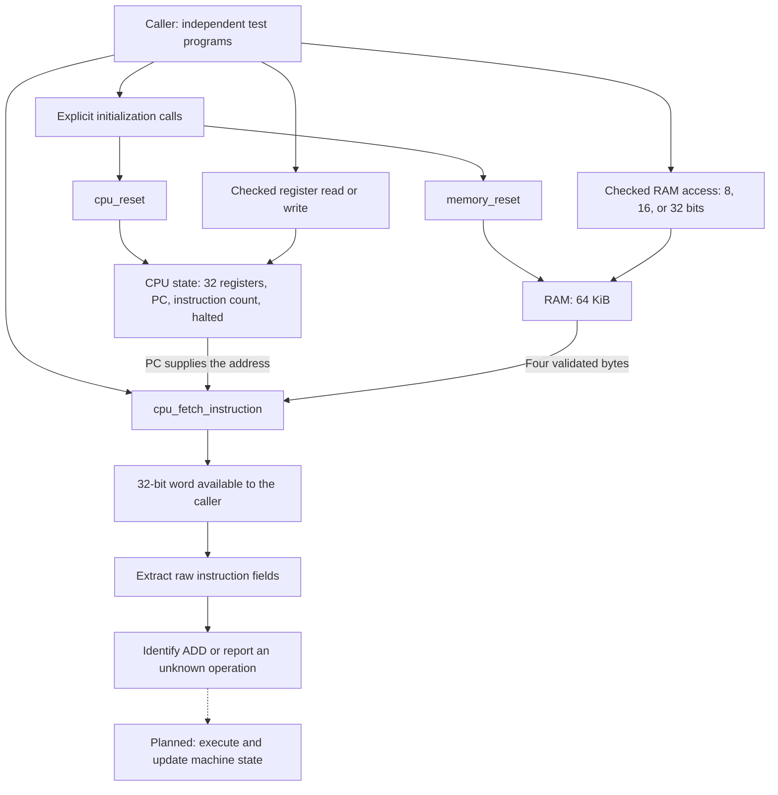
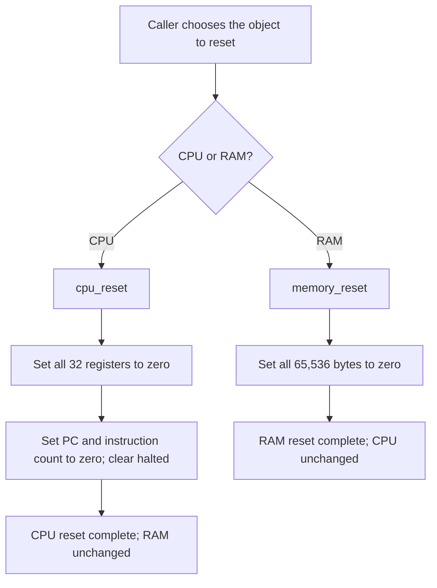
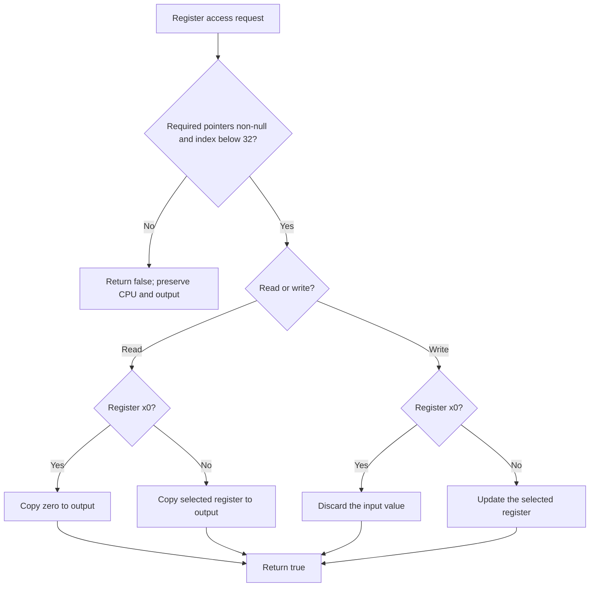
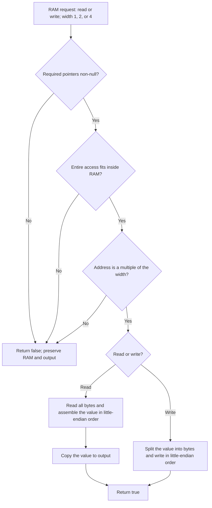
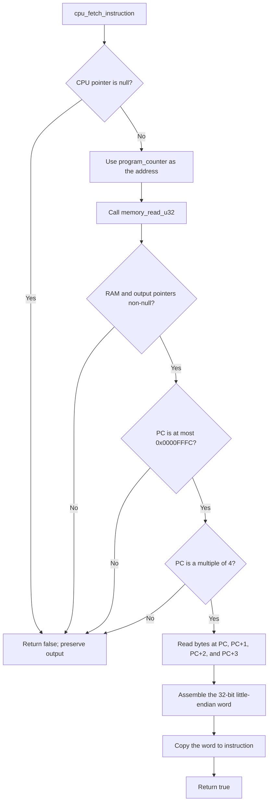
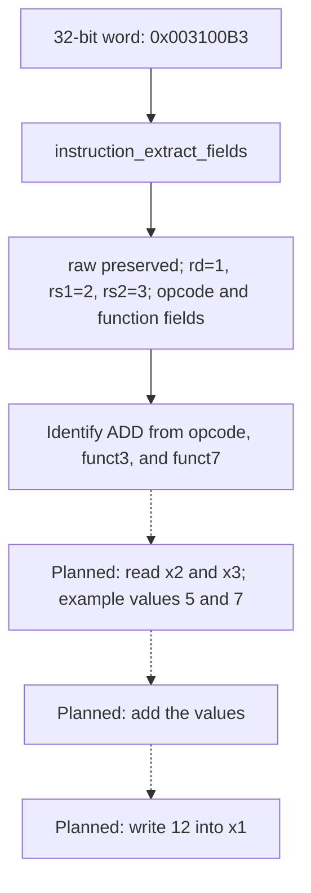
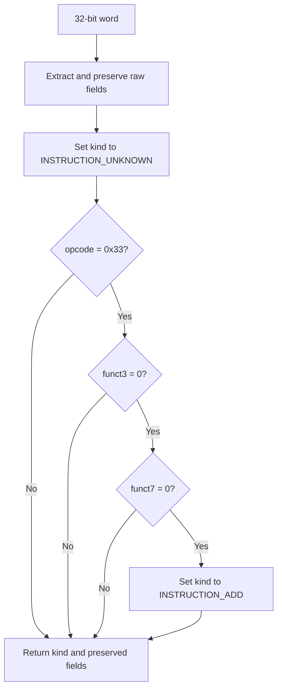

# Core Flowcharts

This document describes the implemented simulator core. Tests currently act as
the caller: there is no application execution loop yet. Solid connections show
implemented operations or data dependencies. Dashed connections are planned work.

## 1. Current core overview

CPU and RAM are separate objects. Preparing one does not automatically prepare
the other. The arrows do not imply an automatic processor loop.

## 2. Reset

Both reset functions require a valid object pointer. They are independent calls.

The individual assignments above describe the resulting state; the C
implementation zero-initializes each complete object.

## 3. Register access

A read requires a CPU pointer and a separate writable output pointer. A write
requires a CPU pointer. The functions reject null required pointers and indices
outside 0 through 31.

These operations preserve PC, instruction count, and halted. The access rules
apply through these functions; direct writes to the public structure bypass them.

## 4. RAM access

The selected function fixes the width to 1, 2, or 4 bytes. A read additionally
requires a separate writable output pointer.

| Width | Alignment | Last permitted starting address |
| --- | --- | --- |
| 1 byte | Any byte address | `0x0000FFFF` |
| 2 bytes | Multiple of 2 | `0x0000FFFE` |
| 4 bytes | Multiple of 4 | `0x0000FFFC` |

For a known valid width, checking `address <= MEMORY_SIZE - width` avoids
overflow in the bounds check. All checks precede memory access. A rejected write
cannot leave a partially updated value. This describes failure behavior in the
current simulator; it is not a thread-synchronization guarantee.

For example, storing `0xFEDCBA98` at address `0x1000` produces:

| Address | Byte |
| --- | --- |
| `0x1000` | `0x98` |
| `0x1001` | `0xBA` |
| `0x1002` | `0xDC` |
| `0x1003` | `0xFE` |

## 5. Instruction fetch

`cpu_fetch_instruction` delegates the memory checks to `memory_read_u32`.
Its output is a raw word; instruction validity is a later decoding decision.

Fetch preserves registers, PC, instruction count, halted, and RAM. It is available
while halted because it only inspects the current instruction location. Output
storage must be separate from the CPU and RAM state.

Example: with PC equal to `0x1000` and the bytes `13 00 00 80` at that address,
fetch returns `0x80000013`. PC remains `0x1000` and instruction count does not
change. Repeating the call returns the same word while RAM and PC remain unchanged.

## 6. Header and implementation placement

`include/cpu.h` declares the public function with a trailing semicolon.
`src/cpu.c` contains its single function body. Putting a normal externally linked
function body in a header gives each including C source its own definition and
can cause a multiple-definition linker error.

`#pragma once` prevents repeated inclusion within a translation unit; it does
not combine function definitions emitted by different C source files.

## 7. Instruction field extraction

This function receives a word by value and returns its raw bits and extracted
fields. It does not access CPU or RAM objects.

In this example, the extracted rs1 value of 2 selects x2; it is not the value
stored in x2. The same instruction encoding can produce different results when
the source register contents change. See the [worked example](HELP.md#worked-example-add).

## 8. ADD recognition

`instruction_decode` extracts the fields and starts with an unknown operation.
Only a match on all three operation selectors identifies ADD.

The three checks form one AND condition. Register numbers do not change the
operation kind. Unknown includes valid operations that are not implemented yet;
it is not an architectural illegal-instruction verdict. CPU and RAM are unchanged.
