# Core and Monitor Flowcharts

These diagrams describe implemented stages 1 through 3. One CPU step attempts
one RV32I instruction; the machine controller supplies the execution loop.

## 1. Current system overview

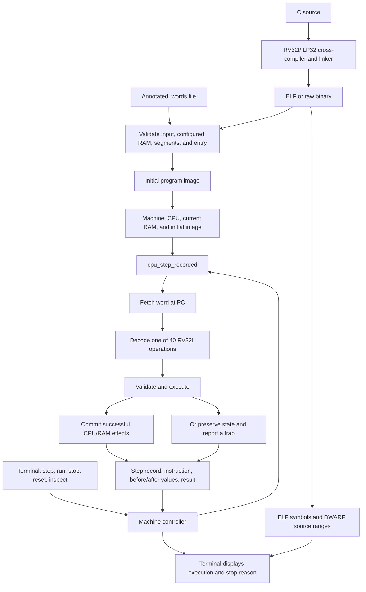

CPU execution does not print or depend on the terminal. The same records can
later drive graphical views. C compilation, ELF/binary loading, and source
mapping are implemented; the desktop interface follows in stage 4.

## 2. Reset and program lifecycle

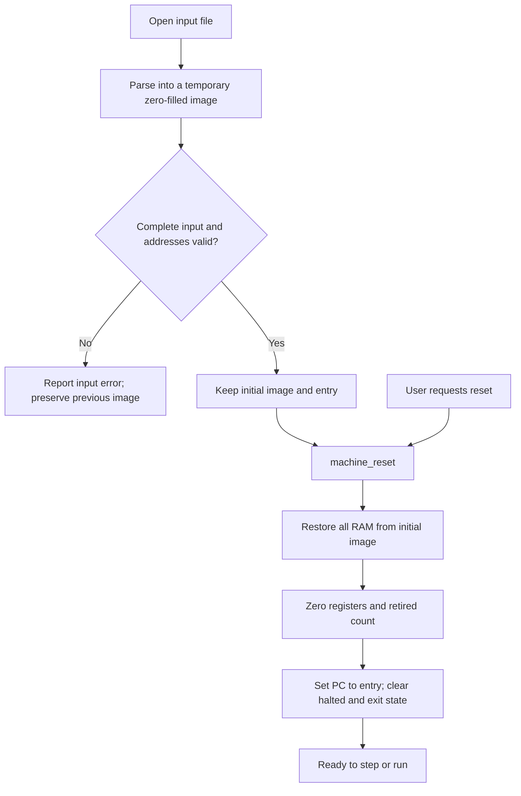

The lower-level `cpu_reset` and `memory_reset` are independent operations.
CPU reset alone does not erase RAM; RAM reset alone does not change CPU.
Machine reset intentionally restores both to the loaded-program starting point.

## 3. Register access

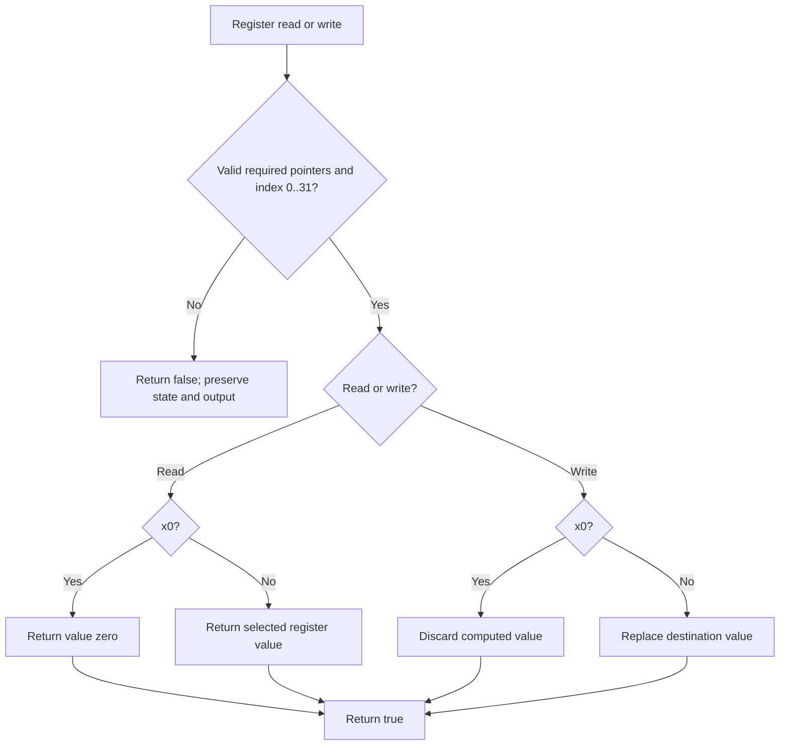

Reading a register selects its stored value, not its register number.
All source values are read before a destination write, so rd may overlap rs1/rs2.

## 4. Loads and stores

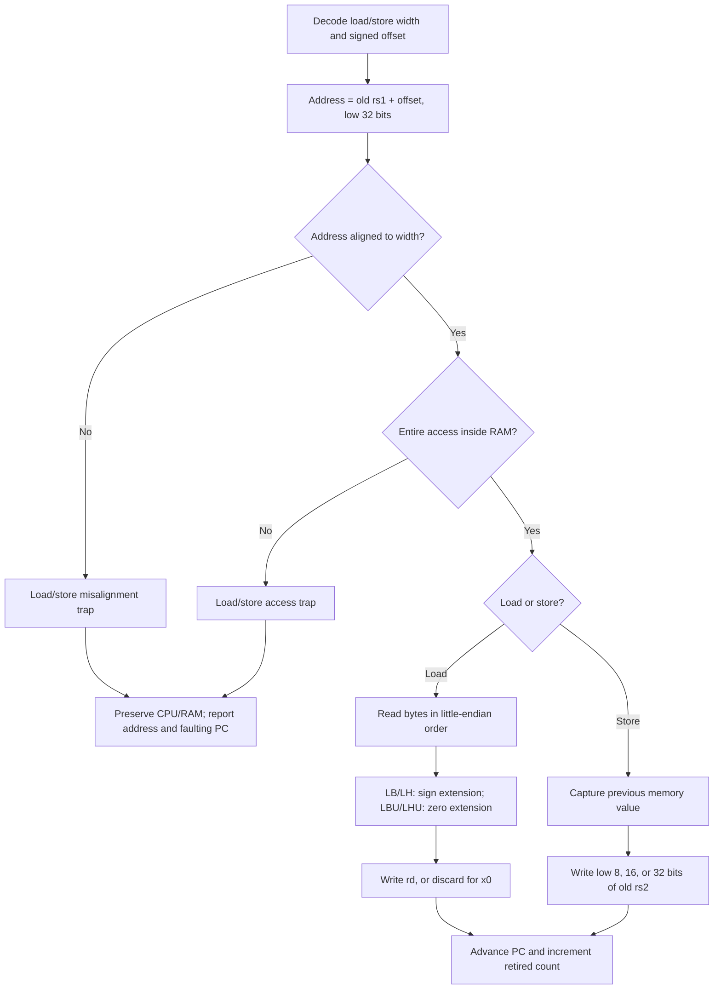

For width 1, 2, or 4, the range test uses
`address <= memory.size - width`. It does not overflow by adding the width.
Load/store execution diagnoses misalignment first; the underlying memory API
returns a single false result for either alignment or range failure.

Even a load to x0 follows the memory-validation path.

## 5. Instruction fetch

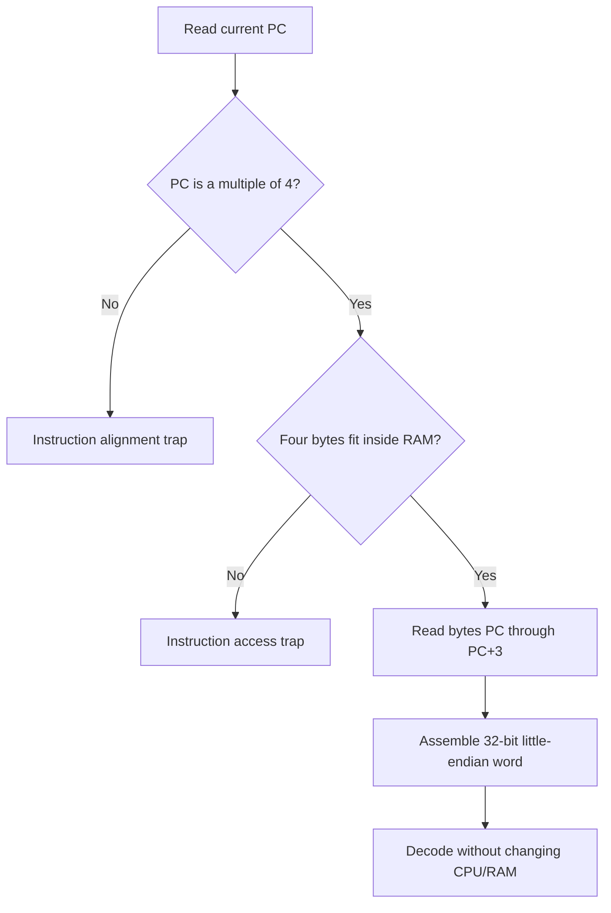

The public `cpu_fetch_instruction` is read-only, also works while halted, and
returns false without changing its output on failure. The combined step adds
the distinct architectural diagnostics shown here.

## 6. Field extraction and decoding

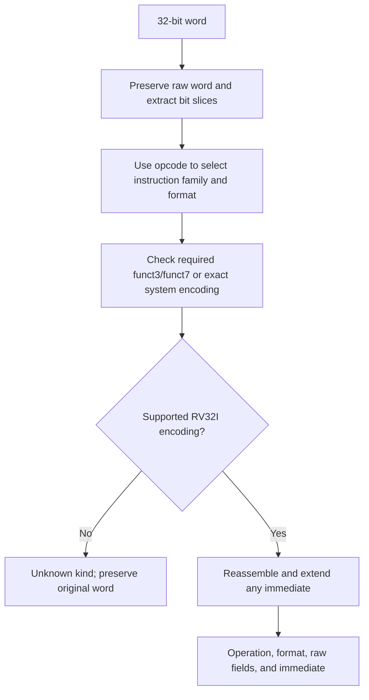

R uses register operands. I embeds a constant. S splits an offset around other
fields. B/J rearrange offset bits and imply a zero low bit. U provides upper
bits. A raw slice named rs2 is not a register operand in every format.

## 7. Integer operations

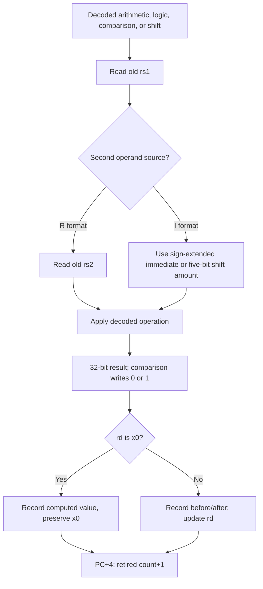

For example, ADDI reads x0=0 and the encoded constant 12, producing x5=12.
ADD then reads its two selected registers. SUB can produce negative bit
patterns; it does not raise an overflow exception.

LUI uses only its upper immediate. AUIPC adds that value to its own instruction
address. Neither consumes rs1/rs2 as meaningful operands.

## 8. Branches, jumps, and fault attribution

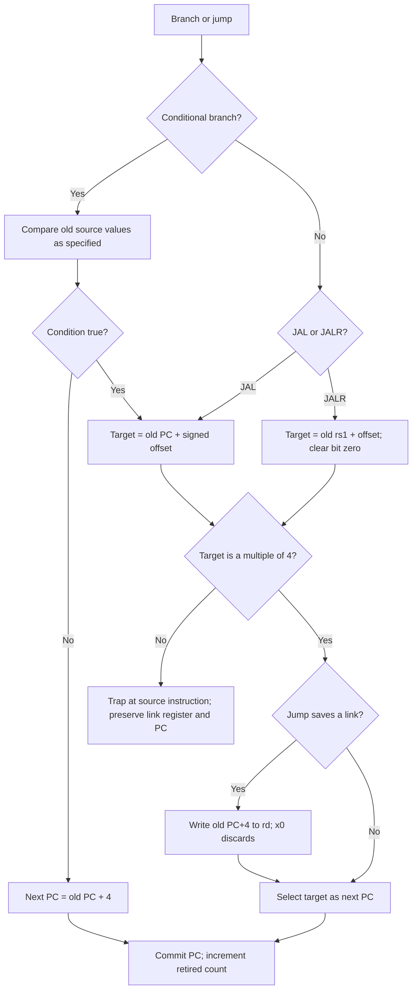

Alignment of an untaken branch target is irrelevant. An aligned target outside
RAM is accepted by the control-transfer instruction; fetching there faults
on the next step.

## 9. Single-instruction execution

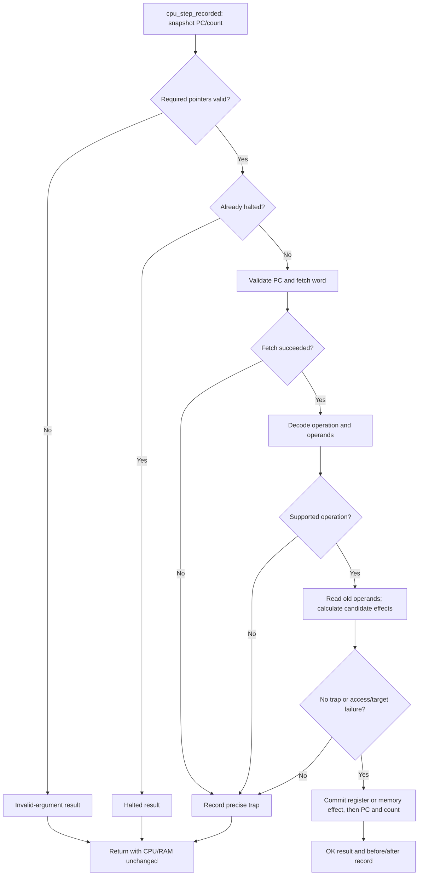

No operation has a fallible action after it modifies architectural state.
The existing flat RAM makes a checked store complete synchronously. The
counter measures successful instructions, not clock cycles. ECALL and EBREAK
take the trap path and do not increment it.

## 10. Monitor execution loop

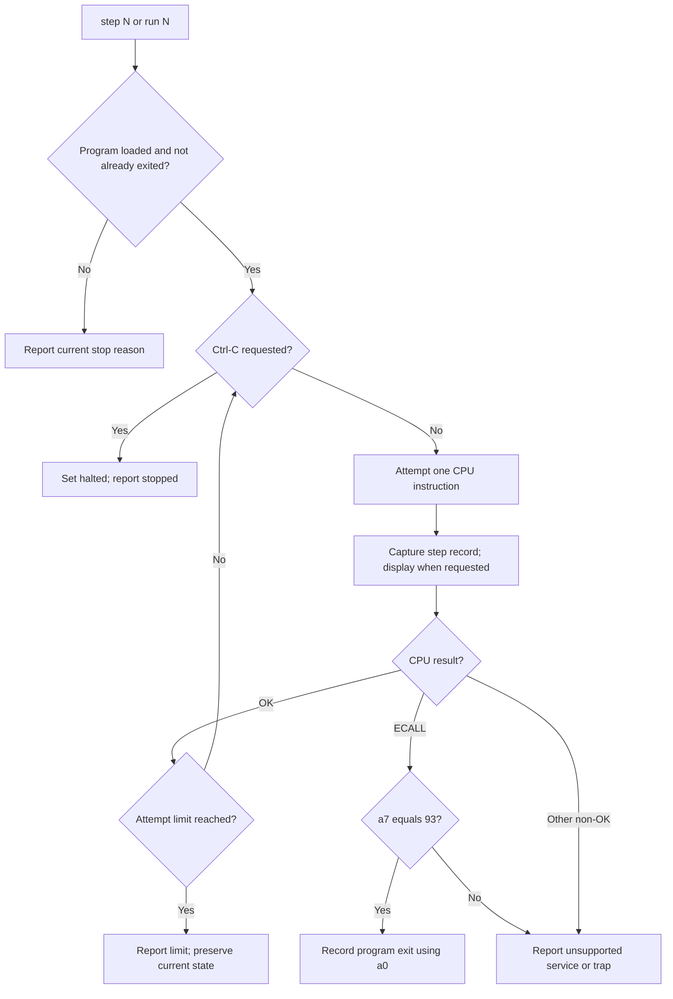

`step` defaults to one attempt and always displays effects. `run` uses the
configured maximum. Ctrl-C is checked between attempts. A later run resumes
a manual stop or limit; an exited program requires reset.

## 11. Sum demo

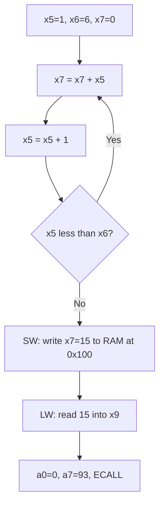

The loop adds 1, 2, 3, 4, and 5. After the last addition, x5 becomes 6 and the
branch falls through. The word 15 appears in memory as `0F 00 00 00`.

## 12. Function call and stack demo

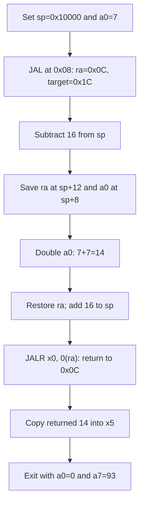

The stack pointer initially names the byte just above RAM; subtracting 16
creates a valid frame before any stack access. The final sp is restored to
0x10000, x5 contains 14, and saved bytes remain available for inspection.

## C compilation and runtime initialization

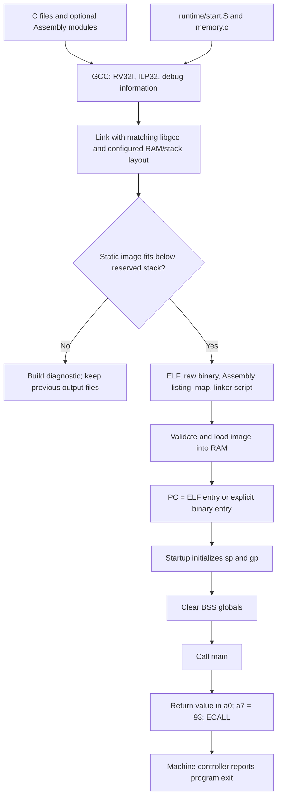

C multiplication and division can call software routines from RV32I libgcc.
The simulated CPU still executes only base RV32I instructions. Startup is part
of the program and is visible in Assembly/source tracing.

## Configurable RAM and ownership

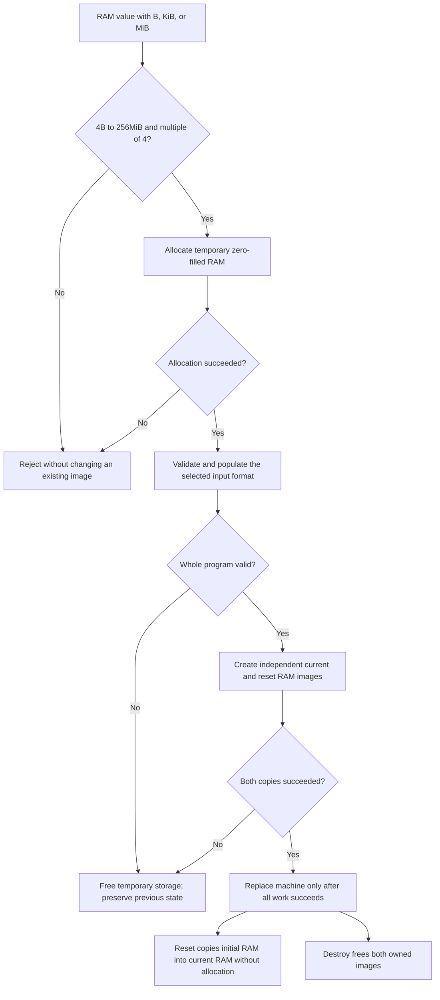

Memory objects carry their capacity. Every access checks the actual allocation,
not a fixed 64 KiB constant. Reset preserves the selected capacity. During
execution, current RAM and reset RAM do not share their bytes.

## ELF validation and zero-filled memory

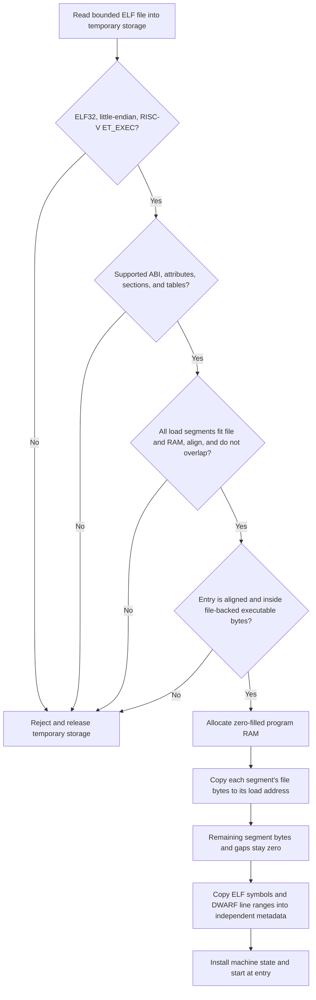

ELF code/data/stack flags describe the image. This simulator checks the entry's
executable segment but does not enforce page permissions during execution.
Raw binaries use supplied load/entry addresses and have no symbols or DWARF.

## Assembly steps and C source locations

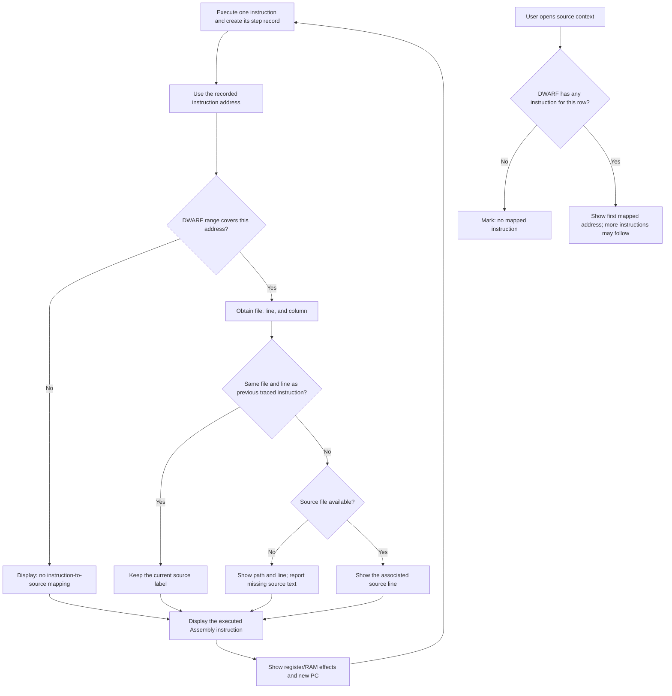

A source label is explanatory metadata. Instruction addresses govern execution.
Blank lines, declarations, compiler transformations, and runtime code prevent a
one-to-one C/Assembly relationship, including at optimization level zero.
